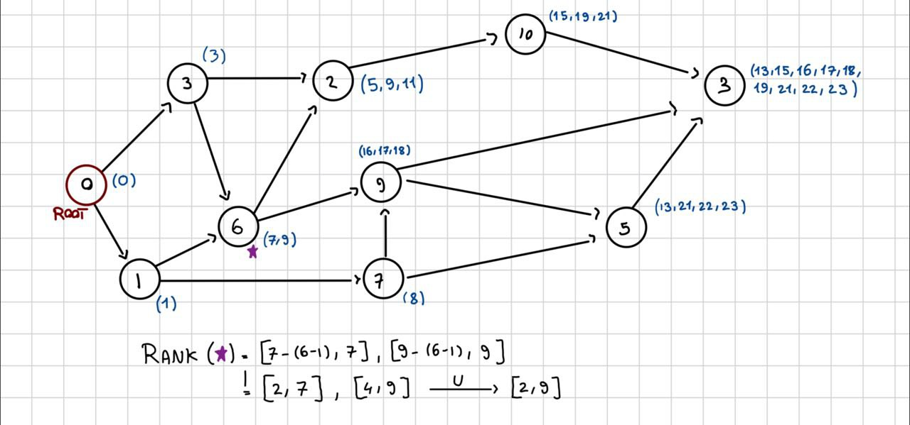

# Struttura del DAG

Ad ogni nodo associamo un set `out` costruito in maniera ricorsiva:

- Inizializzo il root node con il set `(0)`
- Per ogni nodo, il suo set si ottiene unendo i set dei nodi figli e aggiungendo il valore del nodo stesso

Alla fine, una volta pre-computato tutto il grafo, si ottiene associata ad ogni nodo una lista di interi strettamente crescenti (e quindi ben comprimibili!). Una **rank query** segue subito usando il valore del nodo. In particolare, così facendo possiamo dare in output alla query una lista di range (così torniamo alla definizione che avevamo dato) in cui i quelli che overlappano possiamo unirli

# Compressione dei set `out`

## Elias-Fano standard

Utilizzando Elias-Fano standard, otteniamo che per una set con $n$ interi monotonamente crescenti nel range $[0,u)$, occupa meno di $2n + n \lceil \log_2 \frac{u}{n} \rceil$ bit, a prescindere dalla loro distribuzione. Compressione e decompressione in questo caso richiedono tempo $O(n)$.

Se su questa scrittura compressa costruisco sopra un Rank/Select con RRR, posso avere operazioni

- `Access(i)`: restituisce l'i-esimo elemento del set
- `NextGEQ(x)`: restituisce il primo elemento del set maggiore o uguale a x

in tempo $O(1)$ utilizzando solo extra $o(n)$ bits.

## Caso in cui gli elementi dei set sono clusterizzati

Nel caso in cui gli interi sono clusterizzati, Elias Fano ottiene compressione decisamente peggiore rispetto ad interpolative code.

#### Esempio

Consideriamo la sequenza di interi $S' = (1, 2, ..., n-1, u-1)$ di $n$ interi. Questa sequenza si può comprimere fortemente visto la lunghezza della prima run ed il valore di $u-1$ posso enocdarli in $O(\log u)$ bits ciascuno. Elias Fano mi richiederebbe $2 + \lceil \log_2 \frac{u}{n} \rceil$ bits per ogni intero, quindi $2n + n \lceil \log_2 \frac{u}{n} \rceil$ bits in totale.

### Elias-Fano as a distribution-sensitive code

Nel 2014 Ottaviano e Venturini hanno scritto il paper "[Partitioned Elias-Fano Indexes](http://groups.di.unipi.it/~ottavian/files/elias_fano_sigir14.pdf)" dove propongono due approcci per rendere Elias-Fano distribution-sensitive:

1. Il primo si basa su un semplice two-level storage scheme in cui la sequenza $s'$ viene partizionata in $n/m$ chunks di $m$ interi, dove $m$ è un parametro scelto dall'utente. Successivamente il secondo livello è creato utilizzando uno specifico Elias-Fano code su ogni chunk i cui interi sono gap-encoded rispetto all'ultimo intero del chunk precedente (che troviamo nel primo livello). Sia $u_j$ la distanza tra il primo e l'ultimo intero del $j-$esimo chunk; allora Elias-Fano comprimerà gli interi nel secondo livello utilizzando $(2 + \lceil \log(u_j/m) \rceil)$ bits per intero. Questo costo è migliore rispetto a quello di Elias-Fano standard applicato all'intera stringa $S'$, questo perché $(u_j/m)$ è la distanza media all'interno di un bucket, mentre $(u/n)$ è la distanza media tra tutto $S'$. Questo schema migliora la space occupancy fino a circa il 30%, ma rallenta il tempo di decompressione del 10%. Se paragonato ad interpolative coding, questo two-level scheme ha circa il 10% in più di space occupancy, ma è 3-4 volte più veloce nella decompressione.

2. BHO

Sicuramente più vado avanti nel DAG, più alti saranno i valori nei set associati ai singoli nodi. Ha senso quindi fare gap encoding rispetto al nodo padre.

## Compressione rispetto al padre

Per ogni nodo $v$ del DAG, consideriamo tutti i suoi successori: vogliamo comprimerlo in funzione di uno di questi, ma come scegliere il migliore? Per ognuno di questi calcolo le differenze cumulative per ogni padre e alla fine scelto quello che minimizza la somma delle differenze cumulative.

---

#### Esempio

Supponiamo che un nodo abbia valore 5 e i seguenti padri con i rispettivi set:

Padre 1: Set = {1, 3, 4}
Padre 2: Set = {2, 6}
Decompressione: I set dei padri sono già decompressi.

Differenze Cumulative:

Padre 1: |5-1| + |5-3| + |5-4| = 7
Padre 2: |5-2| + |5-6| = 4

Scelta del Padre: Il padre 2 ha la somma delle differenze cumulative più bassa (4), quindi viene scelto come riferimento per il GAP encoding.

---

Ora è il momento di fare gap encoding:

- **Calcolo Differenze**: Sottrai il valore massimo del set del padre ottimale dal valore del nodo corrente e da ogni valore nel suo set.

- **Compressione Elias-Fano**: Comprimi il set risultante (contenente le differenze) utilizzando Elias-Fano.

Adesso devo memorizzare queste informazioni: per fare in modo di poter riconoscere il padre di un nodo, memorizziamo tutto in un dizionario dove:

- Chiave: Identificatore univoco del nodo (puoi usare un semplice intero incrementale).

- Valore: Un oggetto contenente:
  - L'insieme dei valori del nodo compresso con Elias-Fano.
  - Il valore massimo dell'insieme (necessario per il GAP decoding).
  - Un riferimento al nodo padre ottimale
